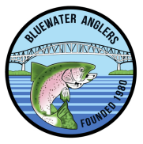

<h1 align="center">
    <br/>
    
    <br/>
</h1>

# Bluewater Anglers - Datasheet Application
---
This program was developed to store information about tanks, fish, and food types for the Bluewater Anglers Hatchery.

### Cloning the project and running locally:
1. Git Clone: ```git clone "https://github.com/Lambton-Digital-Transformation-Lab/blue-water-anglers"```
2. Install the node deps: ```npm i | npm run rebuild```
3. Running locally: ```npm run start``` or ```npm run dev```
4. To create a production build: ```npm run build```

### Creating a new release 
<b>NOTE: CREATING RELEASE WILL AUTOMATICALLY UPDATE THE CLIENT</b>

1. Change the package.json version number
2. Push all the changes
3. Create Git tag: ```git tag v0.0.0``` (Note: add 'v' before the version)
4. Push the tag to github: ```git push origin v0.0.0```

### Refer to the documentation for the following:

- [Installation Guide]("https://github.com/Lambton-Digital-Transformation-Lab/blue-water-anglers/blob/main/src/renderer/src/components/pages/documentation/markdown/installationGuide.md")

- [Restore Database Guide](https://github.com/Lambton-Digital-Transformation-Lab/blue-water-anglers/blob/main/src/renderer/src/components/pages/documentation/markdown/restoreDatabaseGuide.md)

<i>NOTE: When application is initially run it creates a bluewateranglers folder within AppData/Roaming of the user. The AppData/Roaming/bluewateranglers/database directory contains the google service account credential is placed (for enabling auto backup - refer to Installation Guide). "main_database" directory contains the sqlite database file.
